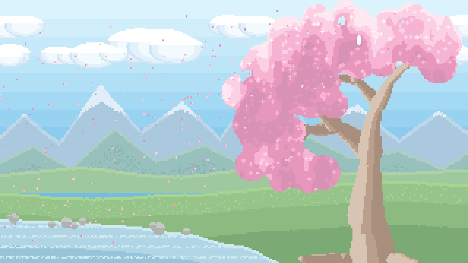

# Sakura

A cherry-blossom theme for Claude Code and Windows Terminal: a pale sky, an
animated wallpaper with petals drifting left, and a light terminal palette
pitched dark enough to stay readable over the picture.



## What's in here

| File | Goes to | What it is |
|---|---|---|
| `sakura.json` | `~/.claude/themes/` | the Claude Code palette |
| `sakura-blossom.gif` | Windows Terminal's `LocalState/` | the wallpaper, 960×540, 300 frames, ~2 MB |
| `sakura_gen.py` | `~/.claude/art/` | regenerates the wallpaper from scratch |
| `theme.sh` | `~/.claude/` | applies all five settings in one move |
| `sl.md` | `~/.claude/commands/` | a `/sl` slash command wrapping the above |
| `install.sh` | — | copies the above into place, then applies |

## Install

Needs WSL, Windows Terminal, and `python3`. Nothing else — no pip, no Pillow,
no ImageMagick.

```sh
./install.sh
```

Windows Terminal reloads the moment its config is saved, so the wallpaper
should change immediately. Claude Code sometimes keeps the old palette until
you run `/config` and reselect it, or restart.

Afterwards, `/sl` reapplies the theme and `/sl status` reports what's active.

The installer finds Windows Terminal by asking Windows for your username and
checking the usual store-package locations. If that fails it says so and
installs the Claude Code half anyway; point it at the right folder with:

```sh
WT_LOCALSTATE=/mnt/c/Users/<you>/AppData/Local/Packages/Microsoft.WindowsTerminal_8wekyb3d8bbwe/LocalState ./install.sh
```

## Why a script for a colour scheme

The theme is five settings across two config files, and setting any one of them
alone leaves the terminal half-dressed:

```
~/.claude/settings.json   theme                      (Claude Code palette)
Windows Terminal          profiles.defaults.colorScheme
                          profiles.defaults.backgroundImage + opacity
                          theme                      (tab row and title bar)
```

`theme.sh` writes all of them, backing both files up to `~/.claude/backups/`
first. It only ever replaces its own entries by name, so your other schemes and
themes survive untouched, and it's safe to re-run.

## Doing it by hand instead

1. Copy `sakura.json` to `~/.claude/themes/`, then set `"theme":
   "custom:sakura"` in `~/.claude/settings.json`.
2. Copy `sakura-blossom.gif` next to Windows Terminal's `settings.json`.
3. Run `python3 theme.sh sakura` for the terminal colours, or lift the
   `SAKURA_SCHEME` and `SAKURA_WT_THEME` dicts out of `theme.sh` into your
   `schemes` and `themes` arrays and set `"theme": "sakura"` plus the
   `profiles.defaults` keys listed above.

## The wallpaper

`sakura_gen.py` carries its own GIF89a encoder, a decoder used to prove the
encoder round-trips, and a PNG writer for eyeballing frames — all stdlib,
because the machine it was written on could not encode an image any other way.

```sh
python3 sakura_gen.py --gif out.gif        # rebuild the wallpaper
python3 sakura_gen.py --png 0,60,120 f     # dump frames as f0.png, f60.png ...
python3 sakura_gen.py --selftest           # encoder/decoder round-trip
python3 sakura_gen.py --decode in.gif 0 p  # decode frame 0 of any gif to p.png
```

Scene, back to front: sky gradient → far ridge → clouds → near ridge → hills →
bank and water → cherry tree → petals. It loops seamlessly: cloud layers are
tileable strips scrolled by exactly one tile per loop, and each petal completes
a whole number of cycles, reappearing inside the blossom canopy where the wrap
is invisible.

The value range is deliberately compressed. The darkest ink in the frame is the
trunk, kept a mid warm brown rather than a near-black silhouette, because it
sits in the right-hand third where long lines and the statusline run — dark
terminal text has to stay readable across it. If you retune the palette, that's
the constraint to respect.

**If you regenerate the art, save it under a new filename** and update
`THEME["image"]` in `theme.sh` to match. Windows Terminal caches the decoded
wallpaper per path, so overwriting a GIF in place leaves it drawing the old
frames until you restart it.

## Uninstall

```sh
rm ~/.claude/themes/sakura.json ~/.claude/commands/sl.md \
   ~/.claude/art/sakura_gen.py ~/.claude/theme.sh
```

Then set `theme` back to whatever you used before in `~/.claude/settings.json`,
and in Windows Terminal drop the `Sakura` scheme, the `sakura` theme, and the
`backgroundImage` keys under `profiles.defaults`. The timestamped copies in
`~/.claude/backups/` are from before the first install, if you'd rather just
restore one.
